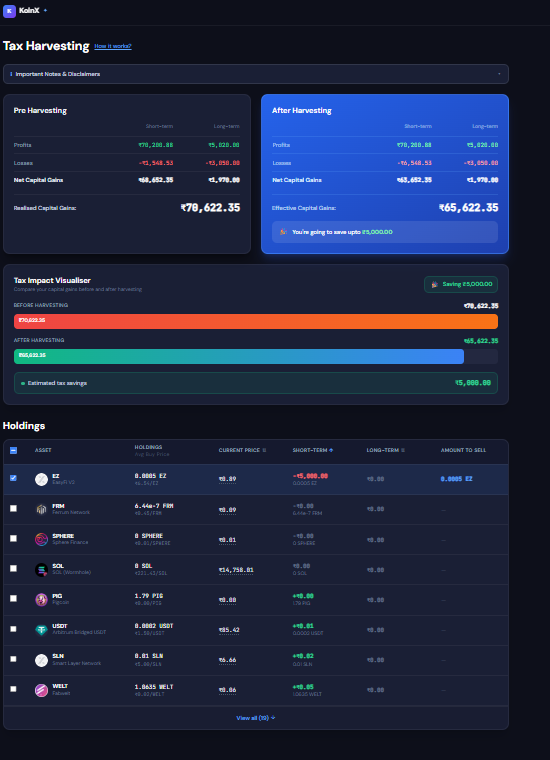

# KoinX – Tax Loss Harvesting Tool

A production-grade Tax Loss Harvesting interface built with **React + TypeScript + Tailwind CSS**, closely matching the KoinX Figma design.

---

## 🚀 Setup Instructions

### Prerequisites
- Node.js 18+
- npm or yarn

### Installation

```bash
# 1. Install dependencies
npm install

# 2. Start development server
npm run dev

# 3. Build for production
npm run build

# 4. Preview production build
npm run preview
```

App runs at: http://localhost:5173

---


# Screenshots

## Main Dashboard



## ✨ Features

### Core
- **Pre-Harvesting Card** — Displays capital gains from mock API (profits, losses, net, realised)
- **After-Harvesting Card** — Live updates as you select holdings; shows potential tax savings
- **Holdings Table** — Full table with 19 crypto assets from mock API
- **Checkbox Selection** — Per-row + Select All with indeterminate state
- **Tax Savings Message** — "You're going to save ₹X" shown only when applicable

### Sorting
- Click **Short-Term**, **Long-Term**, or **Current Price** column headers to sort
- Toggle between Ascending ↑ / Descending ↓ on each click
- Arrow indicator shows active sort direction

### Hover Tooltip
- Hover over **Current Price** to see:
  - Exact price in ₹
  - Total portfolio value (price × total holding)

### UX
- **Loading Skeletons** for both cards and table rows
- **View All / View Less** toggle (shows 8 rows initially)
- **Collapsible Disclaimer** banner
- **Responsive** – works on mobile, tablet, and desktop
- **Dark fintech theme** with smooth animations

---

## 🧮 Calculation Logic

### Pre-Harvesting
```
stcgNet = stcg.profits - stcg.losses
ltcgNet = ltcg.profits - ltcg.losses
realisedGains = stcgNet + ltcgNet
```

### After-Harvesting (Bug-Free)
Always recomputes from base state (prevents accumulation bug):
```
result = clone(baseCapitalGains)

for each selectedAsset:
  if asset.stcg.gain > 0  → result.stcg.profits += gain
  if asset.stcg.gain < 0  → result.stcg.losses += |gain|
  if asset.ltcg.gain > 0  → result.ltcg.profits += gain
  if asset.ltcg.gain < 0  → result.ltcg.losses += |gain|
```

---

## 📁 Folder Structure

```
src/
├── api/
│   └── index.ts          # Mock API (Promise-based, simulated delay)
├── components/
│   ├── Navbar.tsx
│   ├── Disclaimer.tsx
│   ├── GainsCard.tsx     # Pre & After harvesting cards
│   ├── HoldingsTable.tsx # Full table with sort, tooltip, selection
│   └── SkeletonCard.tsx  # Loading skeleton
├── context/
│   └── AppContext.tsx    # useReducer-based state management
├── types/
│   └── index.ts          # TypeScript interfaces
├── utils/
│   └── index.ts          # formatCurrency, applyHarvesting, sortHoldings
├── App.tsx
├── main.tsx
└── index.css
```

---

## 🔧 Tech Stack

| Tech | Usage |
|------|-------|
| React 18 | UI framework |
| TypeScript | Type safety |
| Tailwind CSS v3 | Styling |
| Vite | Build tool |
| useReducer + Context API | State management |
| Promise-based mocks | API simulation |

---

## 📌 Assumptions

1. Each holding is uniquely identified by `coin + index` (since USDC appears twice with different data).
2. "Amount to Sell" is populated with `totalHolding` when a row is selected.
3. The savings message appears only when `preRealised > afterRealised`.
4. Tiny gain values (< ₹0.005) are displayed as ₹0.00 to avoid confusing near-zero noise.
5. Mock APIs simulate network delay (600–800ms) to demonstrate loading states.
